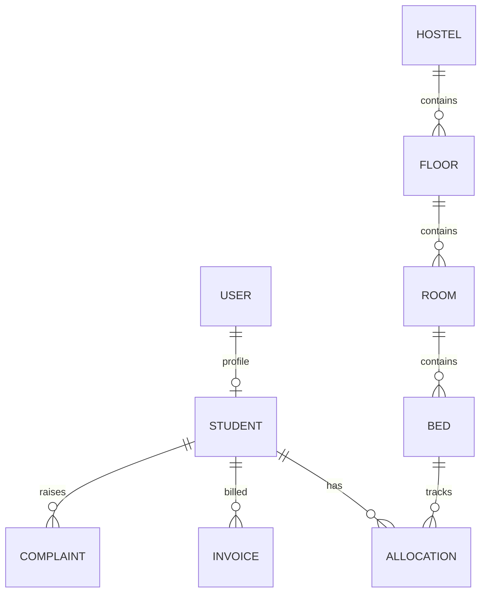

# Hostel Management System Backend

Production-ready backend for managing hostels, floors, rooms, beds, student allocation, fees, and complaints.

## Tech Stack
- Java 17
- Spring Boot 4.0.3
- Spring Data JPA + Hibernate
- Spring Security + JWT
- MySQL
- Maven
- Lombok
- Swagger/OpenAPI (`/swagger-ui.html`)

## Project Structure
```
src/main/java/com/hostel/management
├── config
├── controller
├── dto
├── entity
│   └── enums
├── exception
├── repository
├── security
└── service
    └── impl
```

## Entity Diagram (logical)


## Database Schema (high level)
- `users(id, full_name, email, password, role, active, created_at, updated_at)`
- `student(id, user_id, phone, guardian_name, guardian_phone, enrollment_number, created_at, updated_at)`
- `hostel(id, name, address, created_at, updated_at)`
- `floor(id, hostel_id, floor_number, created_at, updated_at)`
- `room(id, floor_id, room_number, capacity, monthly_rent, created_at, updated_at)`
- `bed(id, room_id, bed_number, occupied, created_at, updated_at)`
- `allocation(id, student_id, bed_id, allocated_from, allocated_to, status, created_at, updated_at)`
- `invoice(id, student_id, billing_month, total_amount, paid_amount, status, created_at, updated_at)`
- `complaint(id, student_id, message, status, created_at, updated_at)`

## API Summary
### Auth
- `POST /api/v1/auth/register`
- `POST /api/v1/auth/login`

### Student
- `POST /api/v1/students`
- `PUT /api/v1/students/{id}`
- `DELETE /api/v1/students/{id}`
- `GET /api/v1/students`

### Hostel, Floor, Room, Bed
- `POST /api/v1/hostel`
- `POST /api/v1/hostel/floors`
- `POST /api/v1/hostel/rooms`
- `POST /api/v1/hostel/beds`
- `GET /api/v1/hostel/rooms/search?hostelId=&floorNumber=&minCapacity=&maxRent=`

### Allocation
- `POST /api/v1/allocations`
- `POST /api/v1/allocations/transfer`
- `POST /api/v1/allocations/{studentId}/vacate`
- `GET /api/v1/allocations/{studentId}/history`

### Fees
- `POST /api/v1/fees/invoices`
- `POST /api/v1/fees/payments`
- `GET /api/v1/fees/students/{studentId}/invoices`

### Complaints
- `POST /api/v1/complaints`
- `PATCH /api/v1/complaints/{id}/status`
- `GET /api/v1/complaints?studentId=`

## SOLID + Patterns Applied
- **Single Responsibility**: split by controller/service/repository + separate security and exception layers.
- **Open/Closed**: DTO contracts and service interfaces enable extension without changing API callers.
- **Liskov / Interface Segregation**: dedicated interfaces per domain (`StudentService`, `FeeService`, etc.).
- **Dependency Inversion**: controllers depend on service interfaces.
- **Patterns**: Layered Architecture, Repository Pattern, DTO Pattern, Strategy-like auth via Spring Security provider.

## Seed Data
On first run, app seeds:
- admin user: `admin@hostel.local / Admin@123`
- student user: `student@hostel.local / Student@123`
- hostel/floor/room/beds sample records

## Run Instructions
1. Start MySQL and create database access credentials.
2. Update `src/main/resources/application.yml` if needed.
3. Build and run:
   ```bash
   mvn clean spring-boot:run
   ```
4. Open Swagger UI:
   - http://localhost:8080/swagger-ui.html
5. Import Postman collection:
   - `docs/postman/Hostel-Management.postman_collection.json`
